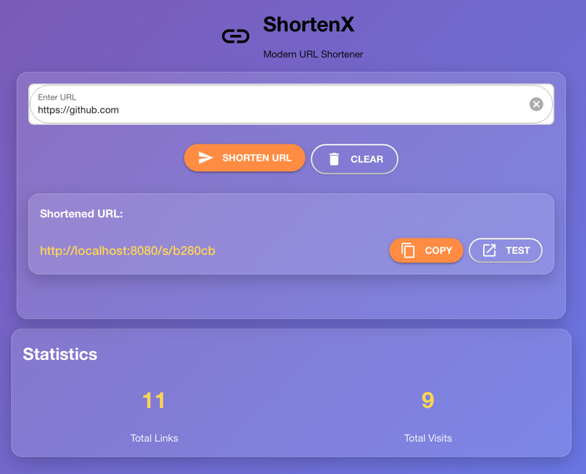

# ShortenX

ShortenX is a modern, stylish URL shortener built using [NiceGUI](https://nicegui.io/) for the front-end and [SQLAlchemy](https://www.sqlalchemy.org/) for the database layer. It features a glassmorphic UI design, dynamic notifications, and an intuitive layout to create shortened links quickly. The interface includes real-time statistics (total links and total visits) and a neat result card with Copy and Test buttons for each generated short URL.

> Long story short, wanted to try out NiceGUI and this was the result. 
> Spent 90/10 fixing style/actually implementing functionality :(
> Unless really needed, use FastAPI/Flask + Jinja2 for web apps, 
> styling issues are not worth that. 

## Features
- **Modern Glass UI**: Utilizes translucency, gradients, and soft, rounded corners for a sleek look.
- **Quick Setup**: Simply install the required Python libraries and run the script.
- **Statistics**: Counts total shortened links and total visits in real time.
- **Copy & Test**: Quickly copy the shortened URL to clipboard or open it in a new tab.
- **Validation**: Notifies the user if an invalid URL is provided.

## How It Works
1. Users enter a URL in the text field.
2. The script validates the URL and generates a random short key.
3. A record is stored in a local SQLite database.
4. A visitor can navigate to `/s/{short_key}` to be redirected to the original URL.
5. Visit counts for each shortened URL are incremented automatically.

## Getting Started
1. **Clone or download** this repository containing the script (e.g., `shortenx.py`).
2. **Install Dependencies**:
   `pip install -r requirements.txt`
3. **Run the script**:
   `python shortenx.py`
4. **Open in Browser**: Navigate to http://localhost:8080 to access ShortenX.

## Folder Structure
- `shortenx.py`: Main application script containing:
  - Database model definitions with SQLAlchemy.
  - Routes for creating and redirecting short URLs.
  - The modern UI layout, styles, and functionality via NiceGUI.
- `url_shortener.db`: Auto-generated SQLite database after the first run.

## Contributing
Pull requests and feature suggestions are welcome. For major changes, please open an issue first to discuss.

## License
This project is open source and available under the MIT License.
